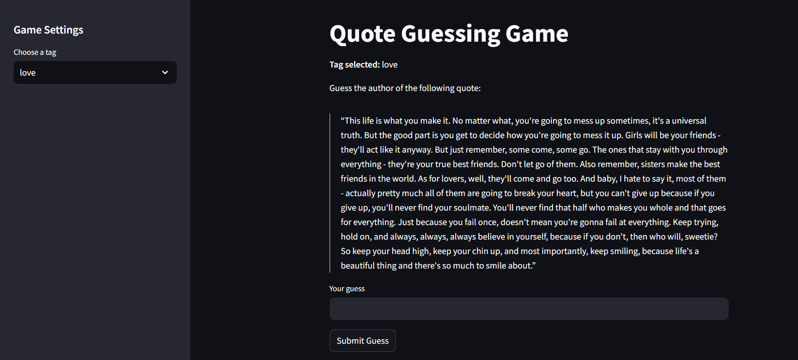

# Quote Guessing Game

A quick and simple Python game that challenges you to guess the author of a randomly selected quote scraped from [Quotes to Scrape](https://quotes.toscrape.com). Hints are given with each incorrect guess until you either guess correctly or run out of attempts.

## Setup

1. **Install dependencies**:  
   pip install -r requirements.txt  

2. **Start the game**:  
   streamlit run app.py

